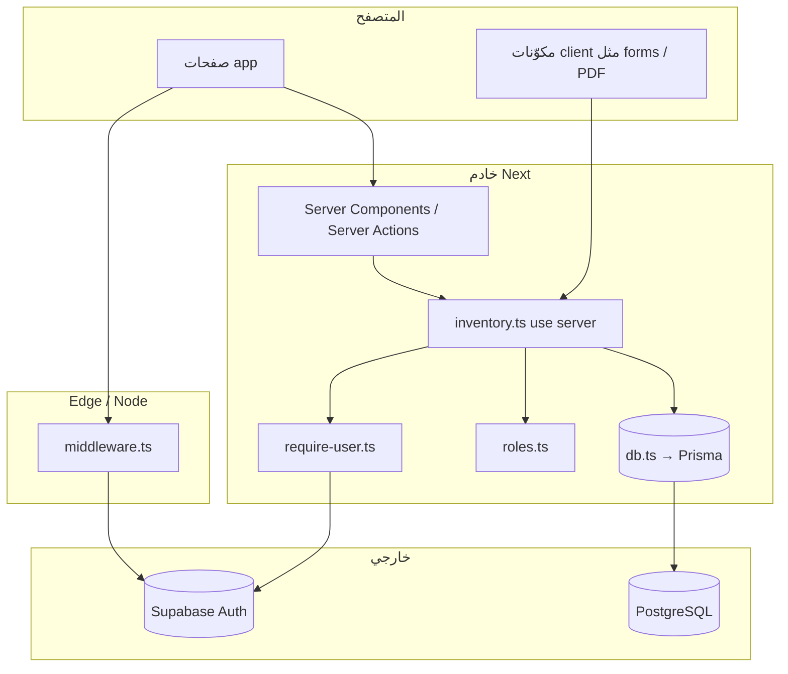

# خريطة النظام والارتباطات (مرجع شامل)

> آخر تحديث مرتبط بهيكل المشروع الحالي: **Next.js 15 (App Router)** + **Prisma 7** + **Supabase (Auth + اختياري Realtime)** + **Tailwind v4**.

## 1) حدود النظام (Scope)

| الطبقة | التقنية | ملاحظة |
|--------|---------|--------|
| واجهة | React 19 + Server Components افتراضيًا | مسارات `(wms)` ديناميكية (`force-dynamic`) |
| مصادقة | Supabase Auth (cookies) | `middleware.ts` + `requireUser()` |
| قاعدة بيانات | PostgreSQL عبر Prisma | `DATABASE_URL` + محول `pg` |
| ترحيلات | Prisma Migrate | مجلد `prisma/migrations/` |
| تحقق من المدخلات | Zod | `src/lib/validations/inventory.ts` |

**لا يوجد `tenantId`:** النظام مفترض **منظمة واحدة** (كل المستخدمين يرون نفس بيانات `items` / `transactions` / `suppliers` ما لم تُضف عزل لاحقًا).

---

## 2) مخطط تدفق الطلب (مختصر)



---

## 3) جدول المسارات (Routes) ↔ مصادر البيانات

| المسار | ملف الصفحة | استدعاءات الخادم (أمثلة) | مكوّنات واجهة بارزة |
|--------|-------------|---------------------------|---------------------|
| `/` | `src/app/(wms)/page.tsx` | `getDashboardData()` | `kpi-grids`, `low-stock-panel`, `recent-movements-panel` |
| `/login` | `src/app/login/page.tsx` | — | `login-form.tsx` |
| `/login` (إجراءات) | `src/app/login/actions.ts` | `signInWithPassword`, `signOut` | يستدعي `createClient` من `lib/supabase/server` |
| `/operations` | `src/app/(wms)/operations/page.tsx` | `getOperationsPageData()` | `daily-operations-forms.tsx` |
| `/items` | `src/app/(wms)/items/page.tsx` | `listItemsPaged()`, `requireUser`, `canDeleteInventoryEntities` | `items-table.tsx`, `item-form-dialogs.tsx` |
| `/suppliers` | `src/app/(wms)/suppliers/page.tsx` | `listSuppliers()`, `requireUser`, `canDeleteInventoryEntities` | `suppliers-table.tsx` |
| `/reports/daily` | `src/app/(wms)/reports/daily/page.tsx` | `getDailyReport()`, `getDailyReportPdfPayload` (عبر الزر) | `report-tables.tsx`, `daily-report-pdf-button.tsx` |

**التخطيط المشترك:** `src/app/(wms)/layout.tsx` يغلّف كل ما سبق بـ `AppShellSidebar` + `RealtimeRefresh`.

---

## 4) طبقة المصادقة والصلاحيات (ارتباطات دقيقة)

| الملف | الوظيفة | يعتمد على | يُستدعى من |
|--------|---------|-----------|------------|
| `src/middleware.ts` | إعادة توجيه غير المسجلين إلى `/login` | `NEXT_PUBLIC_SUPABASE_URL` + `ANON` أو `PUBLISHABLE` مباشرة في Edge | كل الطلبات (حسب `matcher`) |
| `src/lib/env.ts` | `isSupabaseConfigured()` / مفتاح anon | متغيرات `NEXT_PUBLIC_*` | عميل + مكوّنات، وأحيانًا Sidebar |
| `src/lib/supabase/server.ts` | عميل Supabase للخادم (cookies) | نفس المفاتيح العامة | `require-user`, `login/actions` |
| `src/lib/supabase/client.ts` | عميل المتصفح | `NEXT_PUBLIC_*` | `realtime-refresh`, نماذج إن لزم |
| `src/lib/auth/require-user.ts` | `requireUser()` / `getServerUser()` | Supabase server client | كل دوال `inventory.ts` + صفحات تحتاج مستخدمًا |
| `src/lib/auth/roles.ts` | `canDeleteInventoryEntities` | `WMS_ADMIN_EMAILS` (اختياري) + `user.email` | `deleteItem`, `deleteSupplier`، وعرض أزرار الحذف |

**ملاحظة أمنية:** `middleware` يقرأ المتغيرات من `process.env` مباشرة (تعليق في الملف: توافق Turbopack). أي تغيير في أسماء المتغيرات يجب تحديثه في **موضعين:** `middleware.ts` و`lib/env.ts` / `.env.example`.

**وضع التطوير:** إذا لم يُضبط Supabase، `requireUser` قد يعيد مستخدمًا وهميًا في `development` فقط — لا تعتمد على ذلك في الإنتاج.

---

## 5) طبقة البيانات (Prisma + إجراءات)

| الملف | الوظيفة |
|--------|---------|
| `prisma/schema.prisma` | نماذج `Item`, `Supplier`, `Transaction` + فهارس + `onDelete` على العلاقات |
| `prisma.config.ts` | مصدر `DIRECT_URL` لأوامر migrate |
| `src/lib/db.ts` | `PrismaClient` + `PrismaPg` + `DATABASE_URL` |
| `src/lib/actions/inventory.ts` | **مركز تقريبًا كل منطق WMS:** CRUD، تقارير، معاملات، ترقيم صفحات، PDF payload |
| `src/lib/validations/inventory.ts` | مخططات Zod المرتبطة بالمخزون |
| `src/lib/serialize-inventory.ts` | تحويل `Decimal` وعلاقات مختارة إلى شكل آمن للعميل |
| `src/lib/format.ts` | تنسيق أرقام/عناوين للعرض |
| `src/lib/item-unit.ts` | وحدات القياس الموحدة |
| `src/lib/daily-report-pdf-types.ts` | نوع حمولة PDF المشترك |

**جدول إعادة التحقق من المسارات (Cache):** داخل `inventory.ts` الثابت `paths` — أي صفحة جديدة تعرض بيانات تتأثر بالتعديل يجب إضافتها هنا عند استخدام `revalidatePath`.

---

## 6) التحديث اللحظي (Realtime)

| الملف | الجداول المشترَك بها |
|--------|----------------------|
| `src/components/inventory/realtime-refresh.tsx` | `public.items`, `public.transactions` |

عند إضافة جداول جديدة تحتاج تحديثًا فوريًا للواجهة: **إمّا** توسيع الاشتراك هنا **أو** الاعتماد على `router.refresh()` بعد الإجراءات فقط.

---

## 7) مكوّنات UI عامة (تأثير على أي خاصية جديدة)

| المجلد | الدور |
|--------|--------|
| `src/components/ui/*` | مكوّنات shadcn/radix — لا منطق أعمال هنا |
| `src/components/layout/*` | الهيكل العام، الشريط الجانبي |
| `src/components/dashboard/*` | لوحة التحكم فقط |
| `src/components/inventory/*` | مواد، موردين، عمليات، PDF، جداول |

**الشريط الجانبي:** `app-shell-sidebar.tsx` — أي مسار جديد يجب إدراجه في مصفوفة `items` يدويًا.

---

## 8) ملفات الإعداد والبيئة (بدون قيم سرية)

| الملف | الغرض |
|--------|--------|
| `.env.example` | قالب المتغيرات + تعليقات `WMS_ADMIN_EMAILS` |
| `.env` | محلي/سري — **لا يُرفع** (`.gitignore`) |
| `next.config.ts` | إعدادات Next |
| `eslint.config.mjs` | lint |

---

## 9) نقاط تكامل خارجية (Integration checklist)

عند إضافة خاصية تلمس أحد هذه المحاور، راجع الارتباط المقابل:

1. **جدول DB جديد** → `schema.prisma` + migration + (اختياري) فهرسة + تحديث `RealtimeRefresh` إن لزم  
2. **API خادم** → تفضيل Server Actions في `lib/actions/` أو تقسيم حسب النطاق  
3. **صلاحية** → `requireUser` + (إن لزم) `roles.ts` أو توسيع نموذج Supabase  
4. **واجهة جديدة** → `app/(wms)/...` + ربط من `AppShellSidebar` + `revalidatePath`  
5. **تحقق مدخلات** → Zod في `lib/validations/`  
6. **عرض في العميل بدون تسريب أنواع Prisma الثقيلة** → `serialize-*.ts` أو `select` ضيق في الاستعلام  

---

## 10) فهرس سريع لملفات `src` (حسب الدور)

```
src/
├── app/
│   ├── (wms)/          ← صفحات التطبيق المحمية
│   ├── login/          ← دخول/خروج
│   └── layout.tsx      ← جذر التطبيق
├── components/
│   ├── dashboard/
│   ├── inventory/
│   ├── layout/
│   ├── providers/
│   └── ui/
├── lib/
│   ├── actions/inventory.ts   ← منطق أعمال مركزي
│   ├── auth/
│   ├── supabase/
│   ├── validations/
│   └── …utils, format, env
├── hooks/
└── middleware.ts
```

هذا المستند هو **المرجع الأول** قبل فتح المحرر لأي خاصية جديدة.
